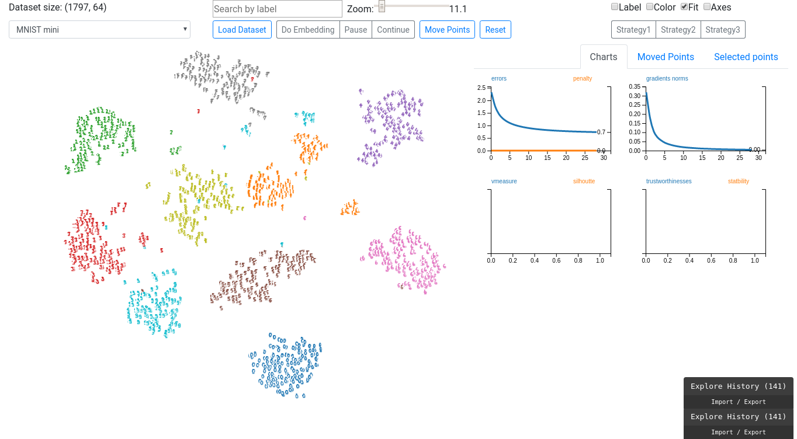

### Interactive t-SNE




### Build final elm-client:
```
cd idr-elm
elm make src/Main.elm --output=main.html
```

For demo (production), use this `main.html`:
+ `cp main.html ./data/`
+ run static server as the following notes.


### Demo workflow in Built environment:
+ Run python socket server (internal port **5000**)
```
cd idr-server/tsnex
python tsnex_flask_socket.py 

```

+ Run static server to serve the image and the final built output `main.html`: (port **8001**)
```
cd idr-server
python -m http.server 8001

# goto lo
```


### Demo workflow in DEV envirionment:

Locate into the root dir of the project
```
pwd # /home/vmvu/WorkspaceSync/IDR
```

+ Run static server to serve the image: (port **8888**)
```
cd idr-server/ # TODO re-check
python -m http.server 8888

```

+ Run python socket server (internal port **5000**)
```
cd idr-server/tsnex
python tsnex_flask_socket.py 

```

+ Run client ELM app (web port **8000**)
```
cd idr-elm
elm-reactor
```


#### Installation notes

1. Install `elm` and client packages
+ [Install `elm`](https://guide.elm-lang.org/install.html)
+ Install used packages

```
cd idr-elm
elm package install --yes

# run elm-reactor in dev mode with auto reload
elm-reactor

```

=> go to [http://localhost:8000/src/Main.elm](http://localhost:8000/src/Main.elm)


2. [Optional] Build client without debug

```
# compile elm to javascript and pack all in a sigle html file
cd idr-elm
elm-make src/Main.elm --output=main.html

# run a simple http server to serve main html file and assert
python -m http.server 8000

```

=> go to [http://localhost:8000/main.html](http://localhost:8000/main.html)


3. Redis server:
    + Install, run service:

        ```
        sudo apt-get install redis-server
        sudo systemctl restart redis-server.service
        sudo systemctl enable redis-server.service # enable on system boot
        ```

    + Python lib: [Redis-py](https://github.com/andymccurdy/redis-py)

        `pip install redis`

    + Monitor:

        * [MONITOR](https://redis.io/commands/monitor) command.
        * [Redis-stat](https://github.com/junegunn/redis-stat)
            - Run: `java -jar redis-stat-0.4.14.jar --server`
            - Host: `http://localhost:63790/`

4. Python websocker server:

    + [Flask sockets](https://github.com/kennethreitz/flask-sockets)

    + Money patching to: `sklearn.manifold.t_sne._gradient_descent` function.

    + Run server: 
    ```
    cd idr-server/tsnex
    python tsnex_flash_socket.py
    ```


#### Algorithm
+ [Notes change in objective function of t-SNE](notes/notes%20change%20in%20objective%20function%20tsne.md)
